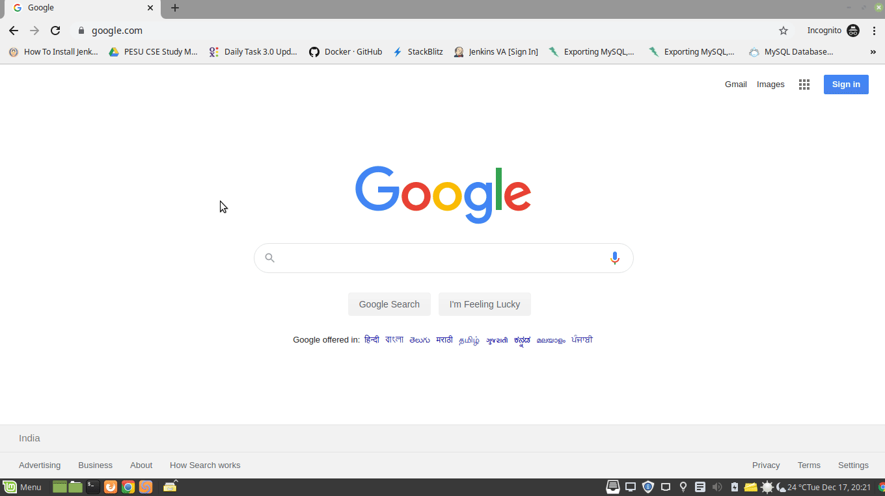
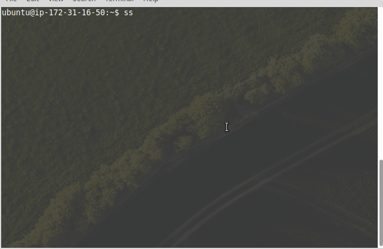
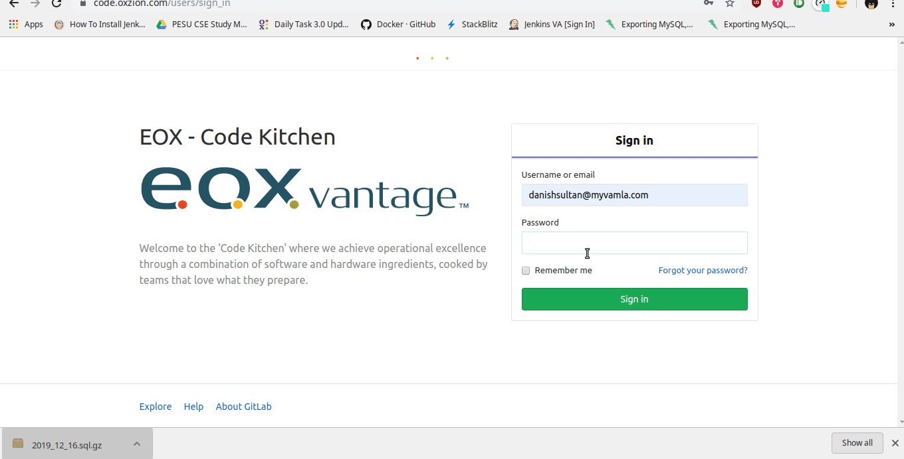
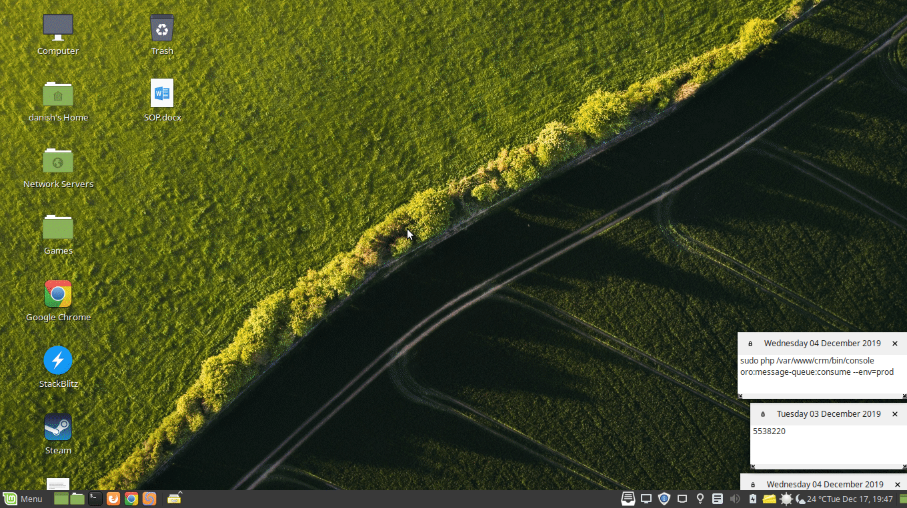

<div align="center">
  <h1>EOS-3.0 DEV ENVIRONMENT SETUP</h1>
  <p>
    Development Environment setup for application development at EOX Vantage.
  </p>
</div>
----

<div align="center">
<h3><u>Installations</u>:</h3>
</div>
-------------------------
- Please install the recommened markdown reader by the command mentioned below to read this readme properly.

$ sudo apt install remarkable

<h4> 1. <u>Install Smartgit</u>: </h4>

<h4>Install git command line</h4>

- $ sudo apt install git

<h4>Download Smartgit from the Official Website</h4>

- Download the debian bundle of smartgit for easy installation


<h5 align="center">GIF: HOW TO INSTALL SMARTGIT</center></h5>
    
- Once Installed you can generate ssh keys and update them in your gitlab account for you to connect the git repository and enable you to do version control without password or you can enter your git account credential to pull code.


<h5 align="center">GIF: HOW TO GENERATE KEYS</h5>
- After you have generated the keys update the public part of key to gitlab account 


<h5 align="center">GIF: HOW TO ADD KEYS TO GITLAB</center></h5>

- Open Smartgit and goto repository tab and select clone to start cloning the codebase to your local machine.
- You need to know the gitlab repository address to clone it which you can find in the gitlab server i.e `code.oxzion.com`.
- We have different branches for different projects going on. The QA branch is for Development Team. Please clone or checkout if already cloned to the required branch to work on.


<h5 align="center">GIF: HOW TO CLONE A REPOSITORY IN SMARTGIT</center></h5>

<h4> 2. <u>Docker</u>: </h4>

To learn how to install Docker [click here.](https://www.digitalocean.com/community/tutorials/how-to-install-and-use-docker-on-ubuntu-18-04)

<h5><center> OR RUN THE FOLLOWING COMMANDS in terminal</center></h5>

- sudo apt update
- sudo apt install apt-transport-https ca-certificates curl software-properties-common

- curl -fsSL https://download.docker.com/linux/ubuntu/gpg | sudo apt-key add -

- sudo add-apt-repository "deb [arch=amd64] https://download.docker.com/linux/ubuntu bionic stable"

- sudo apt update
- sudo apt install docker-ce

<h5>Docker should now be installed, the daemon started, and the process enabled to start on boot. Check that it’s running:</h5>

- sudo systemctl status docker

			Note: Use `sudo` to run docker command
		
-----------

<h4>2. <u>MySql 5.7</u>: </h4>

To learn how to install MySql [click here.](https://linuxize.com/post/how-to-install-mysql-on-ubuntu-18-04/)

<h5><center> OR RUN THE FOLLOWING COMMANDS in terminal</center></h5>

- sudo apt update
- sudo apt install mysql-server

<h5>Once the installation is completed, the MySQL service will start automatically. To check whether the MySQL server is running, type:</h5>
- sudo systemctl status mysql

#####Login to mysql client with superuser privilege for the first time

- sudo mysql

<h5>After installing mysql update your root password </h5><h5> 
If you want to login to your MySQL server as root from an external program such as phpMyAdmin.

Change the authentication method from auth_socket to mysql_native_password. You can do that by running the following command:</h5>
- ALTER USER 'root'@'localhost' IDENTIFIED WITH mysql_native_password BY 'very_strong_ password';
- FLUSH PRIVILEGES;

####To exit the client

- \q or exit

After updating the root password you can login with the new password that you have set by the following

mysql -u 'user_name' -p 'password'

-----------

<h4> 3. <u>Install Smartgit</u>: </h4>

<h4>Download Smartgit from the Official Website</h4>

- Download the debian bundle of smartgit for easy installation


<h5 align="center">GIF: HOW TO INSTALL SMARTGIT</center></h5>

- Once Installed you can generate ssh keys and update them in your gitlab account for you to connect the git repository and enable you to do version control without password or you can enter your git account credential to pull code.


<h5 align="center">GIF: HOW TO GENERATE KEYS</h5>
- After you have generated the keys update the public part of key to gitlab account 


<h5 align="center">GIF: HOW TO ADD KEYS TO GITLAB</center></h5>

- Open Smartgit and goto repository tab and select clone to start cloning the codebase to your local machine.
- You need to know the gitlab repository address to clone it which you can find in the gitlab server i.e `code.oxzion.com`.
- We have different branches for different projects going on. The QA branch is for Development Team. Please clone or checkout if already cloned to the required branch to work on.


<h5 align="center">GIF: HOW TO CLONE A REPOSITORY IN SMARTGIT</center></h5>

<h4> 3. <u>Database Creation</u>: </h4>

- Update bind-address in mysql configuration to allow external connections using ipv4 address

	- $ vi /etc/mysql/mysql.conf.d/mysqld.cnf
	
	`look for "bind-address            = 127.0.0.1"`
        `update it to 0.0.0.0`

<h5>login to your mysql client</h5>

- Database for API

	- create database oxzionapi;

- Database for workflow integration

	- create database `process-engine`;

- Database for camel integration

	- create database quartz_db;

### 4. <u>Run application using [docker-compose](https://docs.docker.com/compose/)</u>

- For globale crdential update, compy .env.example to .env and change the credential according to your ip and other credentislas  
```bash
 $ cp  .env.example  .env
``` 
- To start api, camunda workflow, camel with activemq, view run below command 

```bash
$ docker-compose up -d --build
```
- once the above service is up, you get into bash using below command for eache services
 - Example for api (check docker-compose.yml for services name)
```bash
$ docker-compose run zf /bin/bash
```
- For API 
  - Copy local.php.dist to local.php inside api/v1

	```bash
	$ cp api/v1/config/autoload/local.php.dist api/v1/config/autoload/local.php
	```
  - At this point, you can visit http://localhost:8080 to see the site running.

  - You can also run composer from the image. The container environment is named "zf", so you will pass that value to `docker-compose run`:

    ```bash
    $ docker-compose run zf composer install
    ```	
- For View
	`cp .env.example to .env in all the iframe apps under `view/apps` to your host.`
	```bash
	 $ cp view/bos/src/server/local.js.example view/bos/src/server/local.js
	- update view/bos/src/server/local.js to your host environment
	- $ cp view/bos/src/osjs-server/.env.example view/bos/src/osjs-server/.env and update the SERVER parameter to your host ip. 
	- $ cp view/bos/src/client/local.js.example view/bos/src/client/local.js
	- update the wrapper url parameter to host ip in view/bos/src/client/local.js
	- To enter in view bash mode run below command
		```bash
		$ docker-compose run vw /bin/bash
		```
    - once you are into the view bash follow below instrucnctions - 
	  -  Follow instructions given in the readme files under the specific apps.

	  -	To build the complete view run the following command
	    ```bash
		$ npm run build
        ```
	  -	To clean all view project
	  ```bash
		$ npm run clean
      ```
	  -	To start the node server
	   ```bash
		$ npm run serve		
	   ```

### Note 1: If you followed docker-ompose approach mentioned above, then you need to follow the scripts mentioned below
### Note 2: if you start application using docker-compose at root level, then you have to update crdential only in .env file at root level, but if you run each application separately by entering into services, then update .env at respective places.

#### If you followed docker-ompose approach mentioned above, then you need to follow the scripts mentioned below
<h5>Above are the database required for basic app development and if you want to work for each integrations follow the readme inside each integrations to setup dev environment accordingly</h5>

<h4> 3. <u>Build Docker Images for Development Environement</u>: </h4>

<h5> The development environment uses docker containers for hassle free setup.</h5>

- Follow the readme in each integrations to build the docker images and run the containers

<h4> 4. <u>Updating Configurations</u>: </h4>

		Note : Using relative path below from repository root path
		
		Note : Use IPv4 address of your machine for updating host configurations, to check IPv4 address use `ifconfig` on terminal.
- For API
	- $ cp api/v1/config/autoload/local.php.dist api/v1/config/autoload/local.php
	`update api/v1/config/autoload/local.php`
	`update the database settings as per the database you created in your local machine`

- For Workflow
	- $ cp integrations/workflow/.env.sample integrations/workflow/.env
	`update the database connection in the .env file you just copied`
	`Follow the readme to build the docker image and run the container`
- For Camel	
	- Update integrations/camel/src/main/resources/application.yml, integrations/camel/src/main/resources/oxzion.properties and integrations/camel/src/main/resources/Routes.groovy according to your host ip and database.

- For View
	`cp .env.example to .env in all the iframe apps under `view/apps` to your host.`
	- $ cp view/bos/src/server/local.js.example view/bos/src/server/local.js
	- update view/bos/src/server/local.js to your host environment
	- $ cp view/bos/src/osjs-server.env.example view/bos/src/osjs-server.env and update the SERVER parameter to your host ip. 
	- $ cp view/bos/src/client/local.js.example view/bos/src/client/local.js
	- update the wrapper url parameter to host ip in view/bos/src/client/local.js